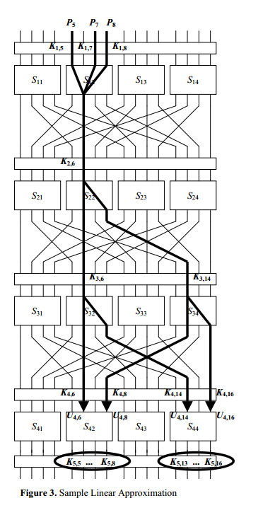

# ZUC SBox1&SBox2差分分析和线性分析实验文档

### 1921210442 刘存展

## 1、Compute the DDT and LAT tabels of ZUC S0 and S1.

### ZUC SBox-0&1 的差分分析表

 

### DDT具体信息：

[SBox-0的差分分析表](./DDTS0.md)

[SBox-1的差分分析表](./DDTS1.md)

### ZUC SBox-0&1 的线性分析表

线性分析图示：

### DDT具体信息：

[SBox-0的差分分析表](./LATS0.md)

[SBox-1的差分分析表](./LATS1.md)

## 2、Answer why a final key mixing is required by a cipher?

因为最后一轮Key Mixing 可以防止攻击者根据DDT&LAT来逆推出上一轮的密钥，最后一轮的key打乱后可以使得攻击难度增加。

## Reference

[zuc_core.c](https://github.com/guanzhi/GmSSL/blob/master/crypto/zuc/zuc_core.c)
[A Tutorial on Linear and Differential Cryptanalysis](http://www.cs.bc.edu/~straubin/crypto2017/heys.pdf)
[线性分析法](https://introspelliam.github.io/2018/04/03/crypto/%E7%BA%BF%E6%80%A7%E5%88%86%E6%9E%90%E6%B3%95/)
[Differential-Cryptoanalysis-of-Block-Ciphers](https://github.com/ulkumeteriz/Differential-Cryptoanalysis-of-Block-Ciphers/blob/737f2168236670c4703e1daea9f917d8331e0837/DifferentialCryptoanalysis.py)
