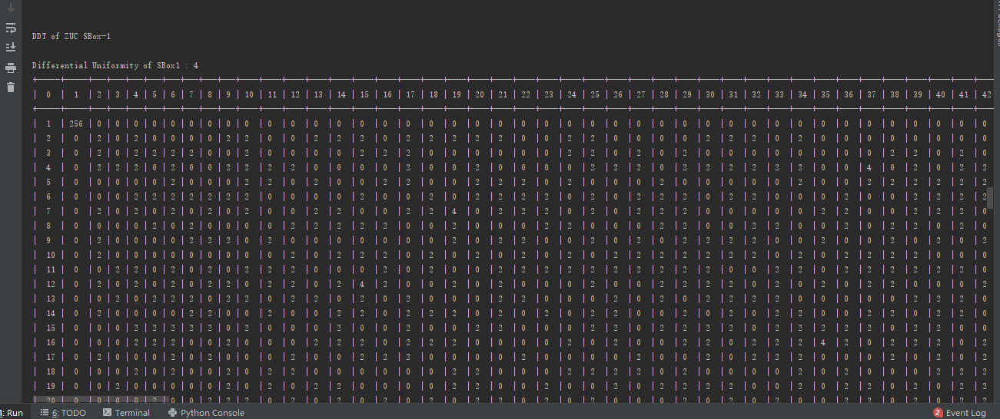
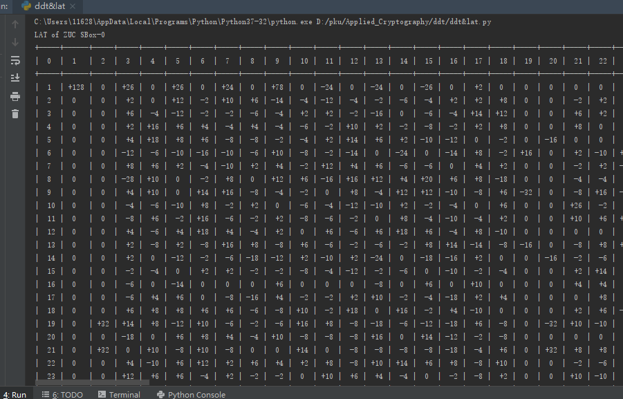
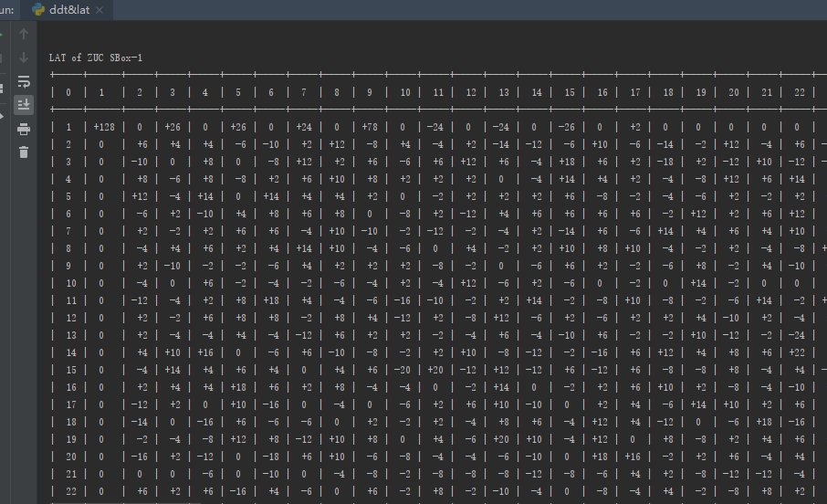

# ZUC SBox1&SBox2差分分析和线性分析实验文档

### 1921210442 刘存展

## 1、Compute the DDT and LAT tabels of ZUC S0 and S1.

### ZUC SBox-0&1 的差分分析表

 

### DDT具体信息：

[SBox-0的差分分析表](./DDTS0.md)

[SBox-1的差分分析表](./DDTS1.md)

### ZUC SBox-0&1 的线性分析表

### DDT具体信息：

[SBox-0的差分分析表](./LATS0.md)

[SBox-1的差分分析表](./LATS1.md)

## 2、Answer why a final key mixing is required by a cipher?

因为最后一轮Key Mixing 可以防止攻击者根据DDT&LAT来逆推出上一轮的密钥，最后一轮的key打乱后可以使得攻击难度增加。
