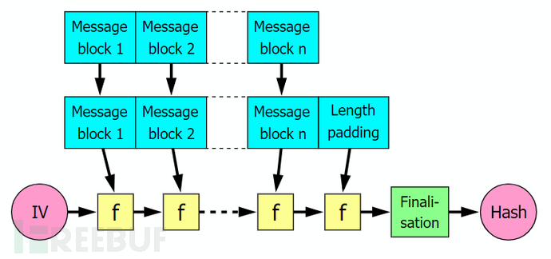
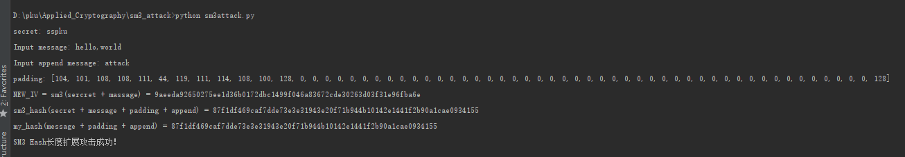

# SM3 哈希长度扩展攻击实验文档

### 1921210442 刘存展

## 思路

哈希长度扩展攻击，本质是针对由于很多哈希算法比如非常流行的MD5、SHA-1等都使用了`Merkle–Damgård construction`进行数据压缩。这里直接借鉴了网上关于MD5哈希长度扩展攻击的方法，来针对SM3哈希函数进行攻击。

假设现在我们只知道`secret`的长度为8，已经`sm3_hash(secret+message)`的哈希值，我们便可以在知道`secret`长度但是不知道具体`secret`值的情况下推算出`sm3_hash(secret + message + padding + m')`。在这里`m'`是任意数据，+ 是连接符，`m'`可以为空,`padding`是填充字节。
`sm3hash`的`padding`字节包含整个消息的长度，因此，为了能准确计算出`padding`的值，`secret`的长度我们也是需要知道的。可以用那个`hash`值作为`sm3_hash(secret + message + padding + m')`的初始IV对`m'`加密。但是需要注意的是在更换新的IV后，再次执行加密时应将对前64bits数据的加密跳过，并且相应的缩减一次加密，换句话说就是使用`sm3_hash(secret + message)`的结果，相当于在不知道`secret`的情况下已经对数据进行了一轮加密，而此轮加密结果将作为下一轮的初试链向量参与加密。

这里注意如果当前的数据长度不满足对512bit求余为448bit的时候，需要补至满足这个条件，填充的方法如下：

	首先补一个1（二进制位上的一个1，不是十进制的1）
	接着在后面补0（同样是二进制位上的0），直到满足比特长度对512求余为448这个条件。
	接着补64bit的长度，这个长度是在补1和0以前的长度，如果长度超出了64bit，那么就取低64bit。
	换句话说：补完的一个块可能是这个样子的：
'''
	raw_data + '\x80' + '\x00'*n + '\x00\x00\x00\x00\x00\x00\x00\x00' 
'''
第一个raw_data的部分就是原始的数据，第二个部分'\x80'是一开始补的一个二进制位1，接着补若干个\x00，直到整个长度达到56Byte，最后的8Byte就是raw_data的长度，如果raw_data的长度超过了2^64bit，则取低64bit.

然而sm3哈希算法中的补位的这部分，就是实现长度扩展攻击的关键。

这里使用了 [gmssl](http://http://gmssl.org/) 用于验证自定义`sm3`哈希函数的正确性

## 运行结果截图

## Reference

[gmssl-python](https://gitee.com/mirrors/gmssl-python/blob/master/gmssl/sm3.py)
[gmssl.org](http://gmssl.org)
[SM3杂凑算法的C、python和go实现](https://blog.csdn.net/weixin_41845533/article/details/98193285#Python_9)
[哈希长度扩展攻击](https://www.0dayhack.com/post-631.html)
[SM3杂凑密码算法](https://wenku.baidu.com/view/8d67d80178563c1ec5da50e2524de518964bd3b6.html?qq-pf-to=pcqq.c2c)
[SM3密码算法 - Python实现](https://blog.csdn.net/qq_37726361/article/details/84196058)
[Everything you need to know about hash length extension attacks](https://blog.skullsecurity.org/2012/everything-you-need-to-know-about-hash-length-extension-attacks)
[借用一道CTF题浅析哈希长度扩展攻击](https://www.freebuf.com/column/186288.html)