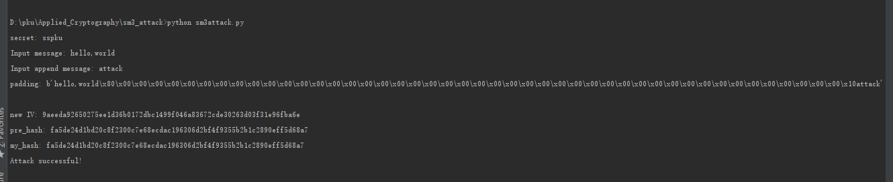

# SM3 哈希长度扩展攻击实验文档
### 1921210442 刘存展

## 思路

假设现在我们只知道secret的长度为8，已经sm3hash(secret+message)的哈希值，我们便可以推算出sm3hash(secret + message + padding + m')。在这里m'是任意数据，+ 是连接符，m'可以为空,padding是填充字节。
sm3hash的padding字节包含整个消息的长度，因此，为了能准确计算出padding的值，secret的长度我们也是需要知道的。可以用那个hash值作为sm3hash(secret + message + padding + m')的初始IV对m'加密
可以再不知道secret的情况下推知sm3hash(secret + message + padding +m')的哈希值。

## 截图

