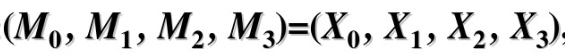
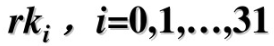
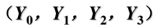
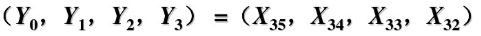
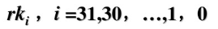
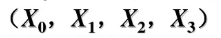
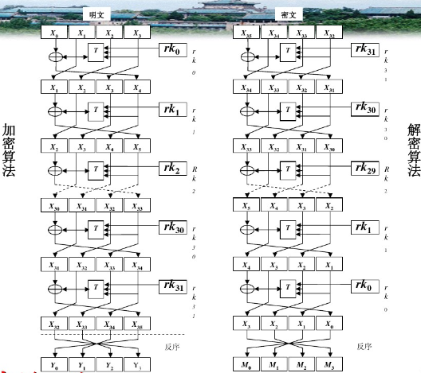
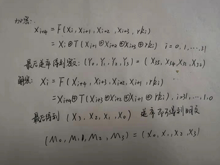
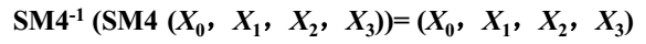

# SM4加密可逆

### 1921210442 刘存展

## 一、SM4加密过程

### 加密算法：

SM4算法以128bit为一组，因此不足16字节或者16字节整数倍的数据需要填充0X00。

输入128位明文：

 

输入32个轮密钥：



输出128位密文：



算法结构：轮函数进行32轮迭代，每轮使用一个轮密钥。
 
## 二、SM4解密过程

### 解密算法：

SM4算法是对合的，因此解密算法和加密算法相同，只是轮密钥的使用顺序相反。

输入密文;

 

输入轮密钥：



输出明文：


 
算法结构：轮函数使用32轮迭代，每轮使用一个轮密钥。
 
## 三、可逆性

加解密轮图：



加解密算法如下：



根据加密轮图可知，SM4加密过程中的数据变化如下：

```
(X0,X1,X2,X3) > (X1,X2,X3,X4) > (X2,X3,X4,X5) > … > (X32,X33,X34,X35) > 逆序 > (X35,X34,X33,X32) = (Y0,Y1,Y2,Y3)
```

根据解密轮图可知，SM4解密的数据变化过程正好相反：

```
(Y0,Y1,Y2,Y3) = (X35,X34,X33,X32) > (X34,X33,X32,X31) > … > (X3,X2,X1,X0) > 逆序 > (X0,X1,X2,X3)
```

可知有：



所以SM4是可逆的,解密算法和加密算法相同，只是轮密钥的使用顺序相反。


